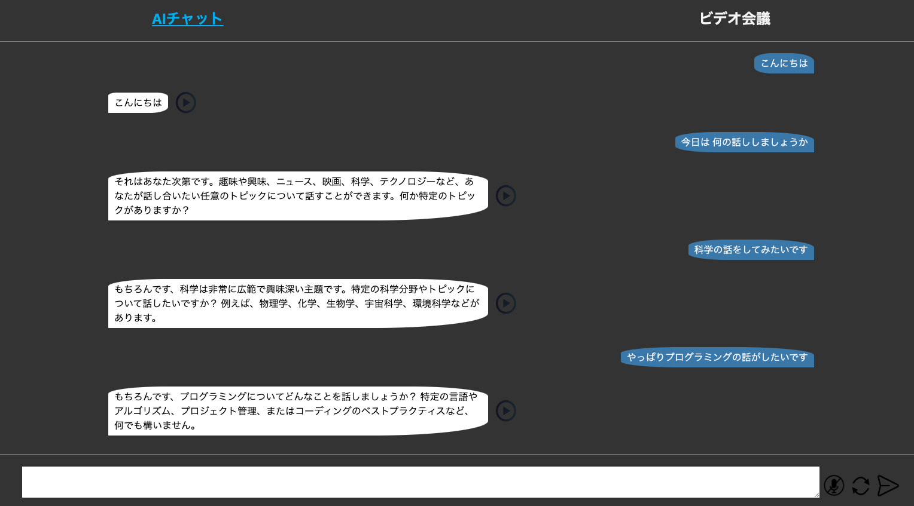
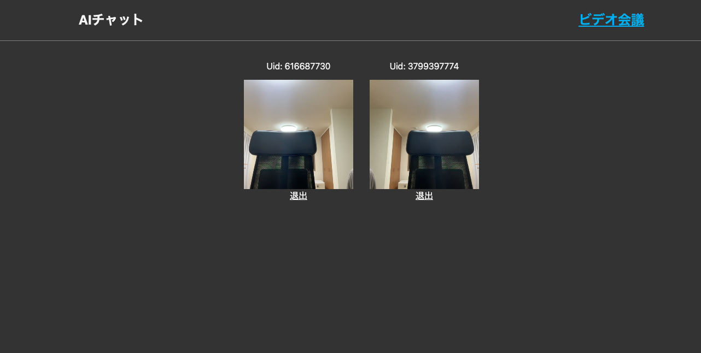
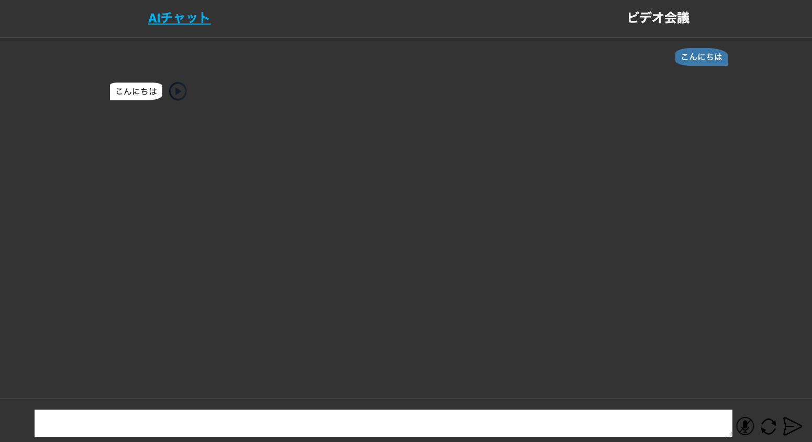
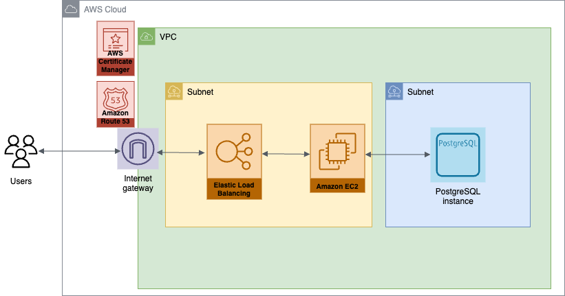

# BTC6 ソロプロジェクト 06\_まっさ

自分が作ってみたいと思えるアプリを作りました
demo ブランチで編集

制作期間：2024/5/23 ~ 2024/5/28

キーワード：

- FE: React + TypeScript. BE: JavaScript + Express + knex + PostgreSQL
- AI(ChatGPT)との音声チャット
- Agora を使用したウェブ会議
- AWS へのデプロイ

## アプリの説明

### ① AI(ChatGPT)との音声チャット



機能：

- 画面下部のテキスト入力エリアからチャットを打てる
- 入力エリアの横のマイクボタンを押すと音声でリアルタイムにテキストを入力できる
- リセットボタンからテキスト入力内容をリセットできる
- 送信ボタンを押すとチャットが送信できる
- チャットの内容に応じて ChatGPT から返信がくる
- 返信の横の再生ボタンを押すと音声が流れる

### ② ビデオ会議



機能：

- 「Join Room」を押すと会議に参加できる
- ビデオと音声を使用できる
- 複数人同時に接続可能
- 退出ボタンから退出できる

## アプリの再現方法

### ① 全体の環境構築

任意のディレクトリに本リポジトリをクローンする

ディレクトリの構成は下記

```
backend
  db
    data
      migrations
      seeds
    .env
    knexfile.js
    index.js
  .env
  index.js
  package.json
frontend
  dist
  public
  src
    components
    App.tsx
  .env
  package.json
  vite.config.ts
README
```

terminal にてデータベースを作成

```
$ createdb solomvp_db
```

### ② フロントエンドの設定

fronend/.env

```
VITE_APPID=< your agora app id >
VITE_TOKEN=< your agora token >
```

[Agora API](https://console.agora.io/)

frontend 直下 terminal で下記コマンドを実行

```
$ npm install
$ npm run build
```

frontend/dist ディレクトリにビルド結果が格納される

### ③ バックエンドの設定

.env ファイルを作成して環境変数を設定

backend/.env

```
PORT = 80
POSTGRES_USER=< your user name >
POSTGRES_DB=solomvp_db
AUTHKEY=< your OpenAI API key >
```

[OPENAI API](https://openai.com/api/)

backend/db/.env

```
PORT = 80
POSTGRES_USER=< your user name >
POSTGRES_DB=solomvp_db
```

backend 直下 terminal で下記コマンドを実行

```
$ npm install
npm run migrate-latest
npm run seed-data
```

### ④ localhost でアプリを試行する

backend 直下 terminal で下記コマンドにより localhost サーバーを起動

```
$ npm run start
```

http://localhost:80 にアクセス

下図のような画面になっていれば成功


## AWS にデプロイ

下図のような構成でデプロイする


参考資料は下記

- [EC2 と PostgreSQL](https://docs.aws.amazon.com/ja_jp/AmazonRDS/latest/UserGuide/CHAP_GettingStarted.CreatingConnecting.PostgreSQL.html)
- [EC2 と https 化](https://qiita.com/nozomiyamada/items/1d18d87a85b798f5eaf5)
- [Route53 とお名前.com](https://dev.classmethod.jp/articles/route53-domain-onamae/)
